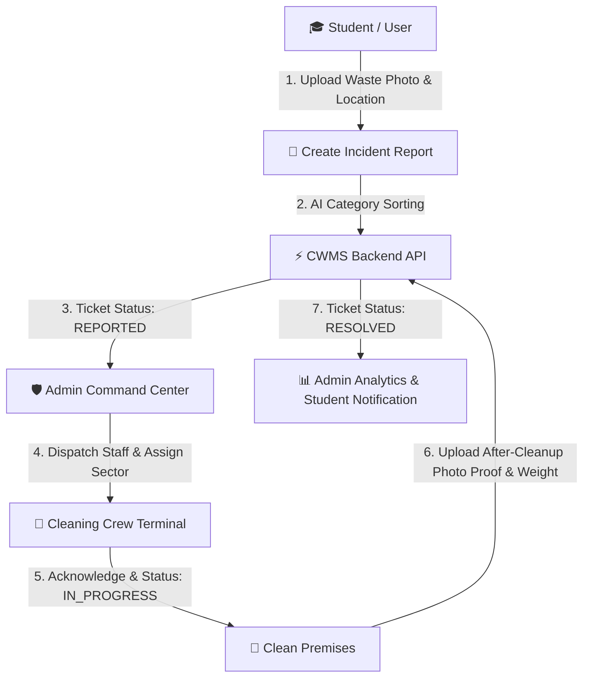

# Campus Wastage Monitoring System (CWMS)
### **Akshaya College of Engineering and Technology**
**Kinathukadavu, Coimbatore – 642109**  
**Official College Website:** [www.acetcbe.edu.in](https://www.acetcbe.edu.in)

---

An automated, intelligent, institutional Smart Campus Wastage Monitoring and Remediation Platform designed for **Akshaya College of Engineering and Technology (ACET)**. CWMS unifies students, facilities administrators, and sanitation personnel with geo-located waste logging, AI-assisted waste sorting, automated dispatch telemetry, and verifiable Before/After cleanup proof.

---

## 🏛️ Institutional Metadata & Branding

| Parameter | Details |
| :--- | :--- |
| **Project Name** | **Campus Wastage Monitoring System** |
| **Institution** | **Akshaya College of Engineering and Technology** |
| **Location** | Kinathukadavu, Coimbatore – 642109 |
| **Website** | [www.acetcbe.edu.in](https://www.acetcbe.edu.in) |
| **Browser Title** | `Campus Wastage Monitoring System \| Akshaya College of Engineering and Technology` |
| **Branding Asset** | Official ACET Header Banner (`client/public/assets/images/college_banner.jpeg`) |

---

## 🌟 Key Features

- **Institutional Branding & Design**: Official ACET college header banner featured on the Landing Page, Login Screen, Student/Staff Dashboard, Admin Command Center, and Cleaning Staff Terminal.
- **Role-Based Access Control (RBAC)**: Distinct, authenticated portals for **Students (`@acetcbe.edu.in`)**, **Cleaning Crew**, and **Facilities Administrators**.
- **Visual Evidence & Waste Reporting**: Students upload waste incident photos with GPS location tagging, building/floor selection, category options, and urgency metrics.
- **AI-Assisted Waste Sorting**: Automated waste category recommendations (Organic/Wet, Recyclable/Dry, E-Waste, Hazardous, Mixed Litter) based on image telemetry.
- **Interactive Campus GIS Hotspot Map**: Real-time Leaflet map displaying 55 ACET campus locations, active waste tickets, and severity heatmaps.
- **5-Stage Sanitation Workflow**:
  $$\text{REPORTED} \longrightarrow \text{ASSIGNED} \longrightarrow \text{ACKNOWLEDGED} \longrightarrow \text{IN\_PROGRESS} \longrightarrow \text{RESOLVED}$$
- **Photographic Resolution Proof**: Mandatory "After-Cleanup" photo evidence upload and waste weight (kg) tracking by cleaning personnel.
- **Dual-Engine Resilient Database Architecture**:
  - Connects to MySQL 8 production database.
  - Seamlessly falls back to an in-memory Zero-Crash Embedded Database pre-seeded with 55 campus locations, 5 waste categories, and test user profiles.
- **Admin Analytics Telemetry**: Live category breakdown charts, hotspot counts, resolution efficiency ratios, and emergency control desk dispatch.

---

## 🏗️ Technology Stack

| Component | Technologies |
| :--- | :--- |
| **Frontend Framework** | React 18, Vite 5, React Router DOM 6, Axios |
| **UI & Styling** | Vanilla CSS Tokens, Lucide Icons, Plus Jakarta Sans Typography |
| **Mapping & GIS** | Leaflet 1.9, React-Leaflet |
| **Backend API** | Node.js, Express 4, JWT Authentication, Multer Multipart Uploads |
| **Database Tier** | MySQL 8 / In-Memory Dual Engine with SQL Schema & Seeds |
| **Security & Auth** | BCrypt password encryption, JWT Bearer tokens, Domain restriction (`@acetcbe.edu.in`) |

---

## 🔄 Project Workflow



---

## 💻 Local Setup Instructions

### 1. Prerequisites
- **Node.js** (v18 or v20+ recommended)
- **npm** (v9+ recommended)

### 2. Clone Repository
```bash
git clone https://github.com/25ad017-afk/campus-wastage-monitoring-system.git
cd campus-wastage-monitoring-system
```

### 3. Install Dependencies
```bash
# Install frontend client dependencies
cd client
npm install

# Install backend server dependencies
cd ../server
npm install
```

### 4. Running the Application

#### Terminal 1 — Backend API Server (`port 5000`):
```bash
cd server
npm start
```

#### Terminal 2 — Frontend Development Server (`port 3000`):
```bash
cd client
npm run dev
```

Open your browser at **`http://localhost:3000`**.

---

## 🔑 Demo / Testing Accounts

| Role | Email | Password | Access / Capabilities |
| :--- | :--- | :--- | :--- |
| **Campus Admin** | `admin@acetcbe.edu.in` | `Admin@123` | Command Center, Live GIS Map, Staff Assignment, Telemetry |
| **Cleaning Staff** | `ramesh.staff@acetcbe.edu.in` | `Staff@123` | Assigned Tasks Queue, Accept Task, Upload After-Photo Proof |
| **Student** | `priya.student@acetcbe.edu.in` | `Student@123` | Waste Incident Reporting, AI Classifier, Track Ticket Status |

---

## ⚙️ Backend Requirements & Cloud Deployment

> **Important Deployment Note:**  
> CWMS includes a full Node.js / Express REST API with file upload handlers (`Multer`), JWT authentication, and database state. Static-only hosts like GitHub Pages can only serve static HTML/CSS/JS. For full production deployment with backend API and image uploads, use one of the following methods:

### Unified Single-Server Deployment (Render / Railway / VPS / Cloudflare Tunnel)
1. Build the frontend client:
   ```bash
   cd client
   npm run build
   ```
2. The Express server (`server/server.js`) automatically serves the compiled frontend (`client/dist`) statically alongside the REST API (`/api`) and Uploads directory (`/uploads`).
3. Launch Node backend: `npm start` in `server/`.

---

## 📄 License
Academic and operational platform for **Akshaya College of Engineering and Technology (ACET)**.

